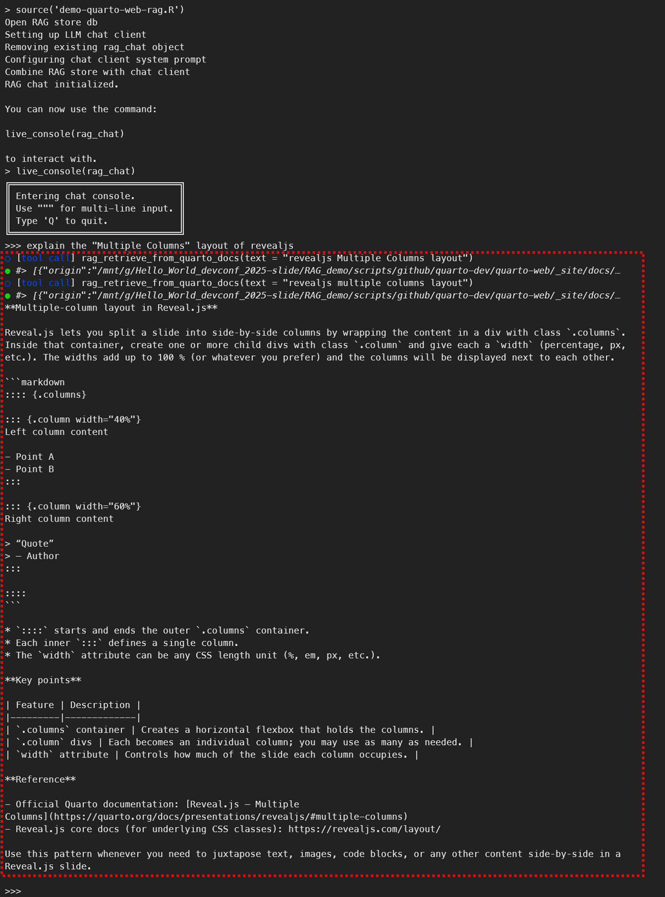

**NOTE:** To run the quarto web site RAG demo on Windows 11, you need to use **WSL2 (Windows Subsystem for Linux)**, enable [mirrored mode networking](https://learn.microsoft.com/en-us/windows/wsl/networking#mirrored-mode-networking).

1. Install anaconda/miniconda<br/>(On [Windows 11 WSL, install miniconda](https://dev.to/sfpear/miniconda-in-wsl-3642) is recommended), <br/>then on `scripts` folder, [create an environment by importing the `environment.yml` file](https://docs.conda.io/projects/conda/en/latest/user-guide/tasks/manage-environments.html#creating-an-environment-from-an-environment-yml-file).
    ```sh
    conda env create -f ./scripts/environment.yml
    ```
2. Activate the conda environment
    ```sh
    conda activate rag-demo
    ```
3. Go to `scripts` sub directory, run the R script to initialize the vector database for Quarto documentation
    ```sh
    Rscript init-quarto-web-rag-db.R
    ```
    It will take some time to complete as it git clones the Quarto docs website source code into the sub directory `scripts/github/quarto-dev/quarto-web`, and runs `quarto render` command to produce the actual publishing HTML files, for creating a vector database file `quarto-web.ragnar.store`:<br/>
    [](https://asciinema.org/a/7gL7KKq7WKeXzRlqLMGHIW4kK)
4. Make sure you have a local LM Studio instance running with a model loaded, e.g. `gpt-oss-20b` model, and the API server is enabled (Settings -> API Server -> Enable API Server).
5. Start the R console by running `R` command, then run the R script `demo-quarto-web-rag.R` to demo the RAG chatbot for Quarto documentation
    ```sh
    source('demo-quarto-web-rag.R')
    ```

    Example conversation: `explain the "Multiple Columns" layout of revealjs`, Result may like below screenshot<br/>
    
